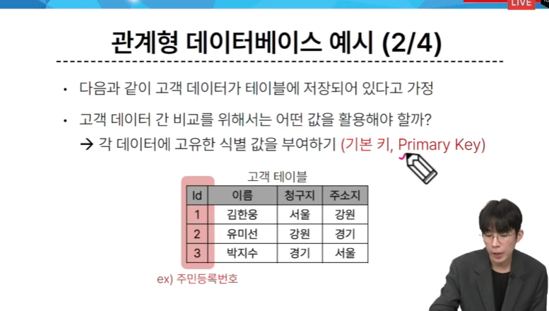
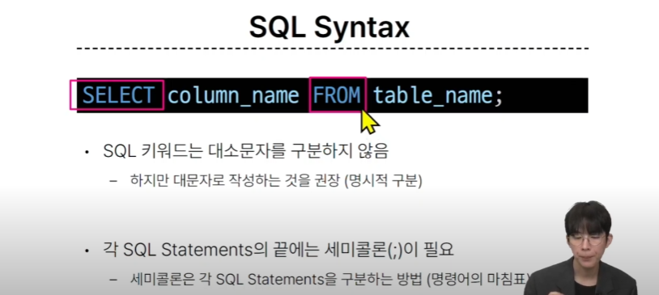
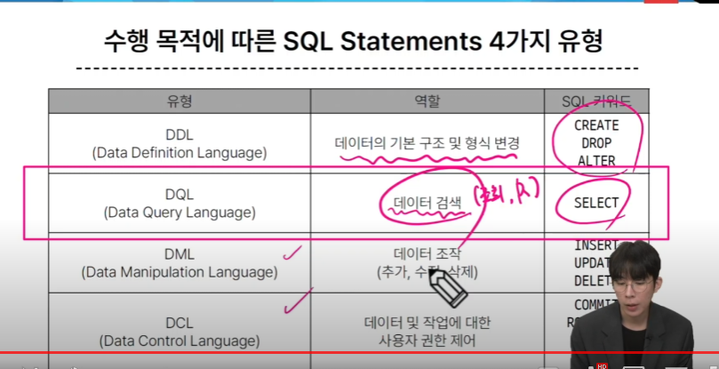
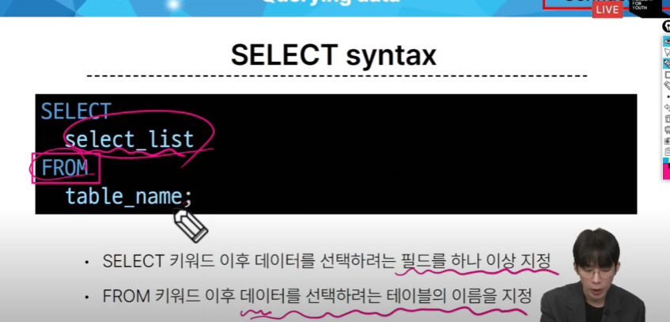
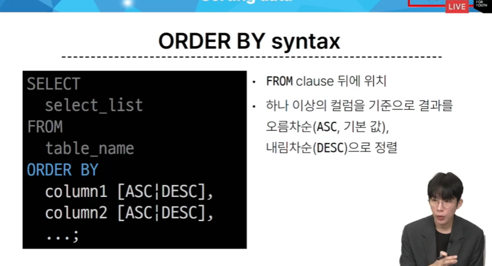
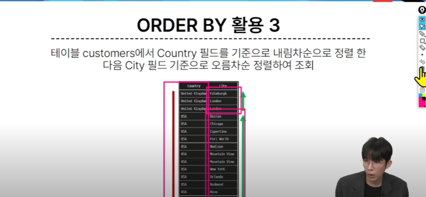
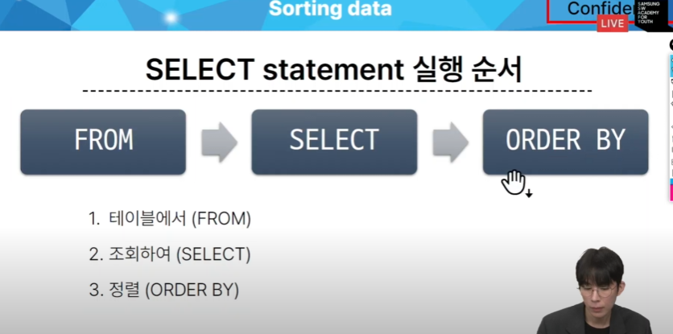
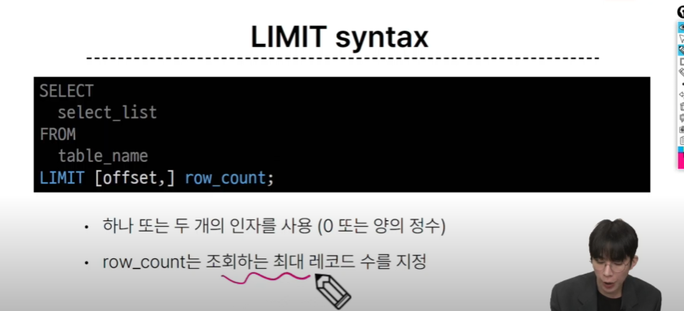
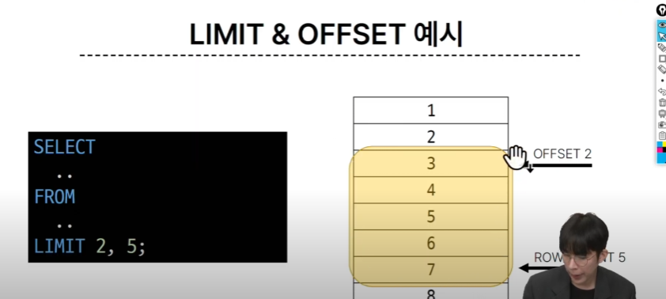

# 1010 온라인 실습

#### INDEX
```
1. Database
2. Relational Database
3. SQL
4. Single Table Queries
    - Querying data
    - Sorting data
    - Filtering data
    - Grouping data
```

### 1. DATABASE

- 체계적인 데이터 모음

- 파일을 이용한 데이터 관리
    - 어디에서나 쉽게 사용가능
    - 데이터를 구조적으로 관리하기 어려움

- 스프레드 시트를 이용한 데이터 관리
    - 테이블의 열과 행을 사용해 데이터를 구조적으로 관리 가능

    - 한계
        - 크기 : 일반적으로 약 100만 행 까지만 저장가능
    - 보안
        - 단순히 파일이나 링크 소유 여부에 따른 단순한 접근 권한 기능 제공
    - 정확성

- 데이터 베이스 역할
    - 데이터를 저장하고 조작
    - CRUD

### 2. RELATIONAL DATABASE

- 관계형 데이터베이스
    - 데이터 간에 관계가 있는 데이터 항목들의 모음
    - 테이블, 행, 열의 정보를 구조화하는 방식
    - 서로 관련된 데이터 포인터를 저장하고 이에 대한 엑세스를 제공

- 관계 :
    - 여러 테이블 간의 (논리적) 연결

- 데이터를 어떻게 식별할 것인가?
    - pk(primary key)
    - 

- 관계형 데이터베이스 관련 키워드
    - 1. Table (aka Relation)
    - 2. Field (aka Column, Attribute)
    - 3. Record (aka Row, Tuple)
        - 각 레코드에는 구체적인 데이터 값이 저장됨
    - 4. Database (aka Schema)
        - 테이블의 집합
    - 5. Primary Key (기본 키)
        - 각 레코드의 고유한 값
        - 관계형 데이터베이스에서 레코드의 식별자로 활용
    - 6. Foreign Key (외래 키)
        - 테이블의 필드 중 다른 테이블의 레코드를 식별할 수 있는 키
        - 다른 테이블의 기본 키를 참조
        - 각 레코드에서 서로 다른 테이블간의 관계를 만드는데 사용

- RDBMS
    - SQLite
    - MySQL
    - Oracle Database

- DBMS 
    - 데이터 저장 및 관리를 용이하게 하는 시스템
    - 데이터 베이스와 사용자 간의 인터페이스 역할
    - 사용자가 데이터 구성, 업데이트, 모니터링, 백업, 복구 등을 할 수 있도록 도움

- 데이터베이스 정리
    - Table은 데이터가 기록되는 곳
    - Table 에는 행에서 고유하게 식별 가능한 기본 키라는 속성이 있으며, 외래 키를 사용하여 각 행에서 서로 다른 테이블 간의 관계를 만들 수 있음
    - 데이터는 기본 키 또는 외래 키를 통해 결합(join)될 수 있는 여러 테이블에 걸쳐 구조화 됨

### 3. SQL (Structure Query Language)

- 테이블의 형태로 구조화된 관계형 데이터 베이스 에게 요청을 질의
- 데이터베이스에 정보를 저장하고 처리하기 위한 프로그래밍 언어



- SQL Syntax
    - SQL 키워드는 대소문자를 구분하지 않음
        - 하지만, 대문자로 작성하는 거을 권장(명시적 구분)
    - 각 SQL Statements의 끝에는 세미콜론(;)이 필요
        - 세미콜론은 각 SQL Statements를 구분하는 방법(명령어의 마침표)

    - SQL Statements
        - SQL을 구성하는 가장 기본적인 코드 블록
        - SELECT, FROM 2개의 keyword로 구성됨



- DQL

***
#### 참고

- QUERY
    - 데이터베이스로부터 정보를 요청 하는 것

- SQL 표준
    - 모든 RDBMS에서 SQL표준을 지원


***
### 4. Single Table Queries

- 1. Querying data

    - SELECT syntax
    - SELECT 키워드 이후 데이터를 선택하려는 필드를 하나 이상 지정
    - FROM 키워드 이후 데이터를 선택하려는 테이블의 이름을 지정

    - 

- 2. Sorting data

    - 하나 이상의 칼럼을 기준으로 결과를
    - 오름차순(ASC, 기본값)
    - 내림차순(DESC) 으로 정렬
    - 

    - 두개 이상의 값에 대해서 한번에 정렬을 할 때
        - 

    - 

- 3. Filtering data

    - Comparision Operators
        - 비교 연산자
        - = , >= , <=, != , IS, LIKE, IN , BETWEEN ... AND
    - Logical Operators
        - 논리 연산자
        - AND (&&) , OR (||), NOT (!)
    - IN Operator
        - 값이 특정 목록 안에 있는지 확인
    - LIKE Operator
        - 값이 특정 패턴에 일치하는지 확인
        - Wildcards와 함께 사용
    - Wildcard Characters

    - '%':
        - 0개 이상의 문자열과 일치하는지 확인
    - '_':
        - 단일 문자와 일치하는지 확인
    - LIMIT clause
        - 조회 하는 레코드 수를 제한
    
    - 
    - 


- 4. Grouping data

    - Group by
        - 레코드를 그룹화 하여 요약본 생성

    - Aggregation Fuctions
        - 집계 함수
        - 값에 대한 계산을 수행하고 단일한 값을 반환하는 함수
            - SUM, AVG, MAX, MIN, COUNT